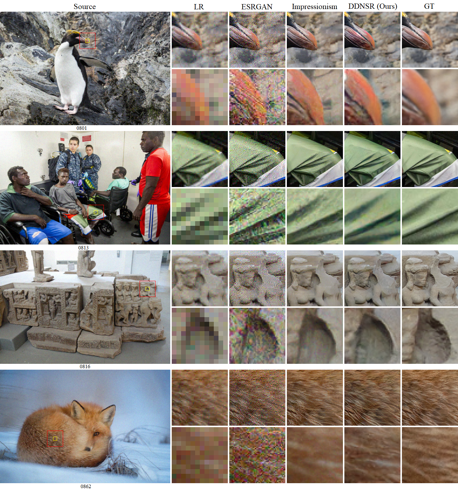

# DDNSR: A Dual-Input Degradation Network for Real-World Super-Resolution

Yizhi Li, Haixin Chen,Tao Li, Binbing Liu

*Huazhong University of Science and Technology*

(*Official Tensorflow Implementation*)

## Perceptual Results

### Track1

- Left part: LR image "0908.png"
- Right part: SR result generated by model "track1_div2k.h5" (see our released pre-trained models)

### track2_canon.h5

- Left part: LR image "00012.png"
- Right part: SR result generated by model "track2_canon.h5" (see our released pre-trained models)

## Visual Comparisons

### Track1

DDNSR: "track1_div2k.h5" (see our released pre-trained models)

### Track2

DDNSR: "track2_cleanup.h5" (see our released pre-trained models)

## Abstract

Real-World Super-Resolution is recently one of the most popular research fields in the scope of Single Image Super-Resolution, as it focuses on real-world applications. Due to the lack of paired training data, real-world super-resolution is considered a more challenging problem. Previous works intended to model the real image degradation process so that paired training images could be obtained. Specifically, some of them try to explicitly estimate degradation kernels and noise patterns, while others introduce a particular degradation network to learn a map from high-resolution (HR) to low-resolution (LR), which is a more direct and practical way. However, previous degradation networks take only one HR image as input, therefore can hardly learn the real sensor noise contained in LR samples. In this paper, we proposed a novel dual-input degradation network, which takes a real LR image as the additional input, to better learn the real sensor noise. Furthermore, we proposed an effective self-supervised learning method, to synchronously train the degradation network along with the reconstruction network. Extensive experiments showed that our dual-input degradation network can better simulate the real degradation process, therefore helping the reconstruction network to outperform \sout{the} state-of-the-art methods. Original codes and most of the testing data could be found on our code website.

## Setup

### Dependencies

- Python3 (match with the tensorflow version)
- [Tensorflow 2.6](https://www.tensorflow.org)
- NVIDIA GPU + [CUDA](https://developer.nvidia.com/cuda-downloads)
- Python packages: `pip install opencv-python tqdm`

### Datasets

NTIRE 2020 Challenge [website](https://competitions.codalab.org/competitions/22220#participate), including (5 in total):

- [Corrupted-tr-x.zip](https://data.vision.ee.ethz.ch/alugmayr/NTIRE2019/public/Corrupted-tr-x.zip)
- [Corrupted-te-x.zip](https://data.vision.ee.ethz.ch/alugmayr/NTIRE2019/public/Corrupted-te-x.zip)

- [DPEDiphone-tr-x.zip](https://data.vision.ee.ethz.ch/alugmayr/NTIRE2019/public/DPEDiphone-tr-x.zip)
- [DPEDiphone-crop-te-x.zip](https://data.vision.ee.ethz.ch/alugmayr/NTIRE2019/public/DPEDiphone-crop-te-x.zip)

- [train-target.zip](https://data.vision.ee.ethz.ch/alugmayr/real-world-sr/NTIRE20/train-target.zip)

Additional dataset

- [DPED](http://people.ee.ethz.ch/~ihnatova/#dataset) dataset (take the canon part only, 5902 images in total)

Clean-up method

- Follow the "[Impressionism](https://github.com/jixiaozhong/RealSR)" team or run the following cammand to generate cleaned-up results.  
  `python3 clean_up.py -input_dir ./your/dir -output_dir ./your/dir`

### The "records.json" File

All directories of training datasets are stored in this file, the naming rules are:

- div2k: using only the clean images from DIV2K (the train-target.zip file) as target
- cleanup: using only the cleaned-up results
- mixed: using both div2k and cleaned-up results, randomly shuffled
- canon: using only the "canon" part in DPED dataset ([their paper](https://ieeexplore.ieee.org/document/8237617))

## Pre-trained Models

We provide pre-trained models of both the degradation network and the reconstruction network in `hdf5` format.

- For Track1 we only provide one model training on target DIV2K.
- For Track2 we provide four different models training on different targets (mentioned above):

## Test

1. Download the pretrained reconstruction model (mentioned above) into this directory.
2. Download "Corrupted-te-x.zip" or "DPEDiphone-crop-te-x.zip" (mentioned above), then unzip to your path.
3. run the following cammand to generate SR results:  
   `python3 test.py -model_path ./your/file.h5 -input_dir ./your/dir -output_dir ./your/dir`

## Train

### Track1

1. Download files "Corrupted-tr-x.zip" and "train-target.zip" (mentioned above), then unzip into the "datasets" directory
1. Make sure the directory names in the "records.json" file is correct (the naming rules were mentioned above).
1. Run `python3 train.py -source_name track1 -target_type div2k`

### Track2

1. Download "DPEDiphone-tr-x.zip", "train-target.zip" and the "DPED" (use the canon part only) dataset (mentioned above), then unzip into the "datasets" directory
2. Follow the "[Impressionism](https://github.com/jixiaozhong/RealSR)" team or run the following code to generate cleaned-up results.  
   `python3 clean_up.py -input_dir ./datasets/DPEDiphone-tr-x -output_dir ./datasets/dped-clean`
3. Make sure the directory names in the "records.json" file is correct (the naming rules were mentioned above).
4. Running options:  
   `python3 train.py -source_name track2 -target_type cleanup`  
   `python3 train.py -source_name track2 -target_type div2k`  
   `python3 train.py -source_name track2 -target_type mixed`  
   `python3 train.py -source_name track2 -target_type canon`
   